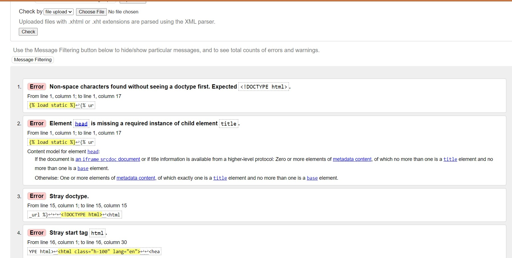
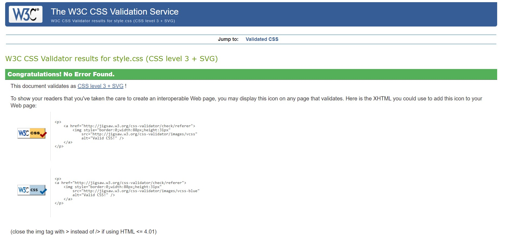

<h1 align="center">Boardom Be-Gone</h1>

[View the live project here.](https://boardom-be-gone-92a7cf5b2b91.herokuapp.com/)

This is an online board game shop. It is designed to have a good range of games to suit audiences from all age groups..

## User Experience (UX)

-   ### User stories

    -   #### Customer Goals

        1. As a Customer, I want to easily be able to navigate the site and find the right game for me.
        2. As a Customer, I want to be able to easily order products and save products for future purchasing.
        3. As a Customer, I want to be able to contact the admin staff if i have any questions about specific games including ones not listed.

    -   #### Staff Goals

        1. As Staff, I want to easily add and remove stock.
        2. As Staff, I want to be able to update listings on the site including stock availability.
        3. As Staff, I want to have the ability to easily reply to customer messages.

-   ### Design
    -   #### Colour Scheme
        -   The main colours used are black, white and grey
    -   #### Typography
        -   The Shadows Into Light font is used as the main font throughout the website for all paragraphs and links, and the Cinzel font is used for headings.
    -   #### Imagery
        -   Imagery is important. I used a stock parchment image as the background for the website to give it that RPG parchment effect. 
    -   #### Wireframes
        -   [View](static/images/Boardom-Be-Gone_Wireframes.bmpr)
     
## Features

-   Responsive on all device sizes

-   Interactive elements

## Technologies Used

-   HTML, CSS, Django, Bootstrap, JQuery, JavaScript, Git, Github, Kanban, Canva, Cloudinary, Crispy Forms

## Testing

-   W3c HTML validator
  
-   Jigsaw CSS validator
  
-   JSHint showed no errors in JavaScript code
-   CI Python Linter showed no major errors, some minor errors, ie line too long in models.

### Further Testing

-   The Website was tested on Google Chrome, Internet Explorer, Microsoft Edge and Safari browsers.
-   The website was viewed on a variety of devices such as Large Screen Television, Desktop, Laptop, Tablet, and a range of different android and apple smartphones
-   A large amount of testing was done to ensure that all pages were linking correctly, all links directed to the correct area, all forms submitted correctly and items all added correctly to basket and saved for later.
-   Friends and family members were asked to review the site and documentation to point out any bugs and/or user experience issues.

## Deployment

### GitHub Pages

The project was deployed to GitHub Pages using the following steps...

1. Log in to GitHub and locate the [GitHub Repository](https://github.com/)
2. At the top of the Repository (not top of page), locate the "Settings" Button on the menu.
    - Alternatively Click [Here](https://raw.githubusercontent.com/) for a GIF demonstrating the process starting from Step 2.
3. Scroll down the Settings page until you locate the "GitHub Pages" Section.
4. Under "Source", click the dropdown called "None" and select "Master Branch".
5. The page will automatically refresh.
6. Scroll back down through the page to locate the now published site [link](https://github.com) in the "GitHub Pages" section.

### Forking the GitHub Repository

By forking the GitHub Repository we make a copy of the original repository on our GitHub account to view and/or make changes without affecting the original repository by using the following steps...

1. Log in to GitHub and locate the [GitHub Repository](https://github.com/)
2. At the top of the Repository (not top of page) just above the "Settings" Button on the menu, locate the "Fork" Button.
3. You should now have a copy of the original repository in your GitHub account.

### Making a Local Clone

1. Log in to GitHub and locate the [GitHub Repository](https://github.com/)
2. Under the repository name, click "Clone or download".
3. To clone the repository using HTTPS, under "Clone with HTTPS", copy the link.
4. Open Git Bash
5. Change the current working directory to the location where you want the cloned directory to be made.
6. Type `git clone`, and then paste the URL you copied in Step 3.

```
$ git clone https://github.com/YOUR-USERNAME/YOUR-REPOSITORY
```

7. Press Enter. Your local clone will be created.

```
$ git clone https://github.com/YOUR-USERNAME/YOUR-REPOSITORY
> Cloning into `CI-Clone`...
> remote: Counting objects: 10, done.
> remote: Compressing objects: 100% (8/8), done.
> remove: Total 10 (delta 1), reused 10 (delta 1)
> Unpacking objects: 100% (10/10), done.
```
